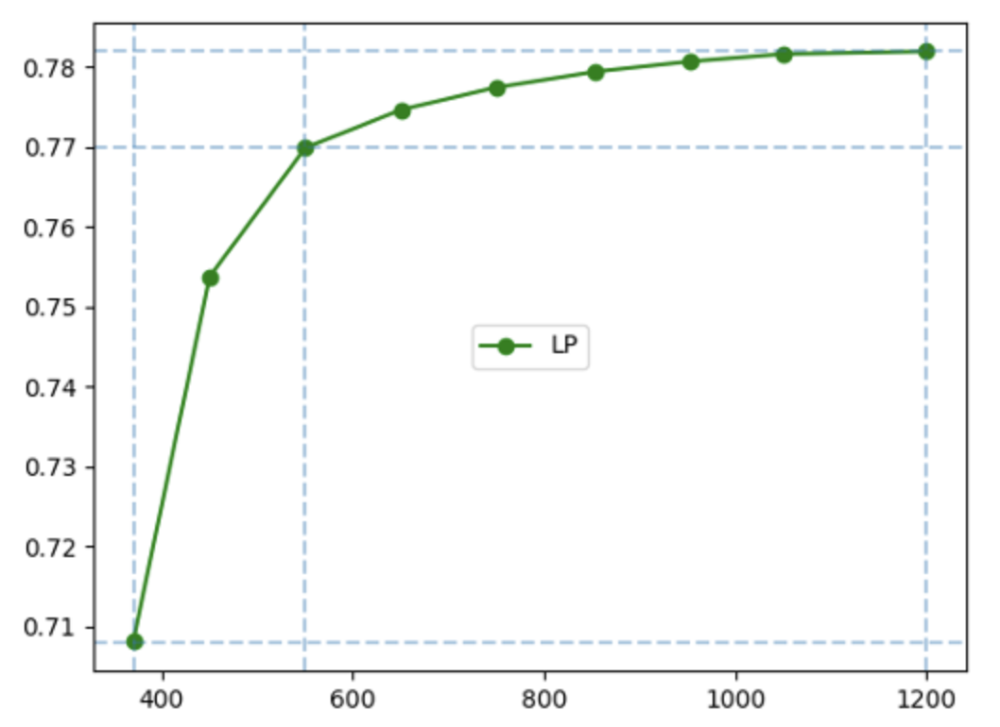
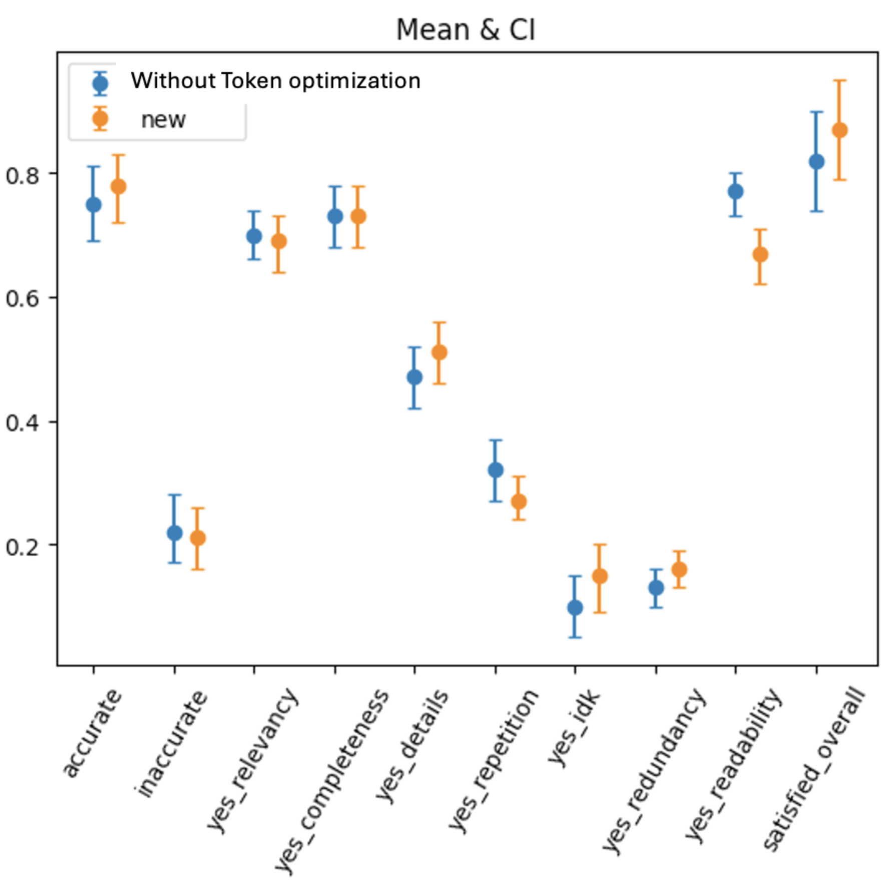

# Towards Optimizing the Costs of LLM Usage

## BERTScore prediction dataset

We selected around 6500 text samples from various sources such as bigpatent, samsum, wiki bio datasets. Each data point in this dataset was annotated with BERTScore, taking GPT-3.5-Turbo's summaries as the reference gold standard. In this case, our cascade of models consisted of Text-Davinci-003, Text-Curie-001, and Vicuna-13b-1.2. Each line in the jsonl is a json format string. It consists of the context, gold_summary(generated by GPT-3.5), and summary which contains the candidate summaries, and scores which contains scores of those candidate summaries (in order: davinci, curie and vicuna).

## Sentence simplification dataset

WikiLarge dataset comprises of 359 test sentences, 2000 development sentences and 300k training sentences. These are pairs of complex and simplified sentences. Each source sentences in test set has 8 simplified references. Refer the following for WikiLarge - https://github.com/XingxingZhang/dress. We have curated our labelled dataset where every source (complex) sentence has been prepended with 2 tokens indicating the BERTScore between that sentence and the target sentence in the dataset and the ration of number of tokens between the source and target sentences using the OpenAI’s tiktoken tokeniser.

Example -

<BERTSCORE_0.95> <NUMTOKENSRATIO_0.8> Archaeological evidence
suggests a history of settlement in the area since roughly 2000 BC.

Archaeological evidence shows settlement in the area since 2000 BC.

## Graphs

